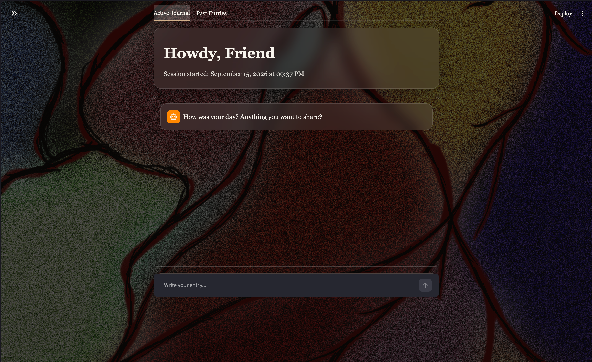

# Final-Assignment-Talk-To-A-Stranger

Welcome to the **Talk To A Stranger** , a secure, local-first web application built with Python and Streamlit. 

# About Talk To A Stranger 

Talk To A Stranger is a private journaling application designed to serve as a safe space for your thoughts. Unlike standard AI chatbots that read and analyze your data, this app simply provides pseudo-random conversational "nudges" (like *"Tell me more"* or *"What will you do now?"*) to encourage deep, open-ended reflection without judgment.

**How it works & What it does:**
* **Local-First Privacy:** Absolutely no data leaves your machine. Your entries are saved locally to a `journal.csv` file on your hard drive. No cloud, no tracking.
* **Emergency Safeword:** Before you begin, you set a "safeword". If you type this word into your journal at any time, the app instantly locks down to a safe screen and saves your progress.
* **Immersive Environment:** The app uses custom "glassmorphism" styling, background wallpaper, and ambient rain audio to create a calming writing environment.
* **Archiving:** All of your past entries are amalgamated by session and can be safely reviewed in the "Archive" tab.

---

# File Structure

Before running the program, your project folder in PyCharm should look like this:

my-journal-project/
│
├── app.py            # The main Python script containing the application code
├── background.png     # (Optional) Local background image for the UI
├── journal.csv        # Auto-generated by the app to store your entries
└── README.md          # This documentation file

If you want to change the background in the program, simply upload a new .png file named 'background.png' in the place of the current 'background.png' file.

The packages you need to install via pip before running the program are the following:
- streamlit (pip install streamlit)

Also make sure you have activated the vfirtual environment. This can be done in the terminal by using the following command:
.venv/bin/activate

To run Talk To A Stranger, run this command in the terminal built into PyCharm after activating the virtual environment:
streamlit run app.py

Now you're good to go. Have fun journaling or processing the repressed trauma that our world breeds.
